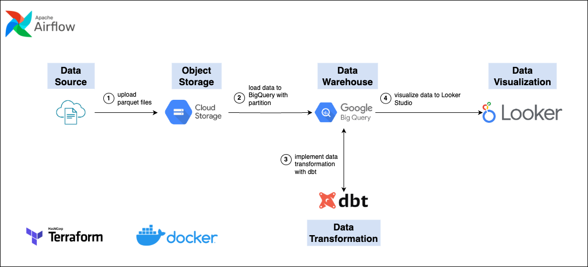
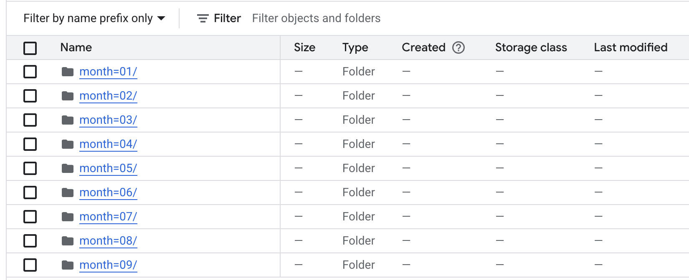
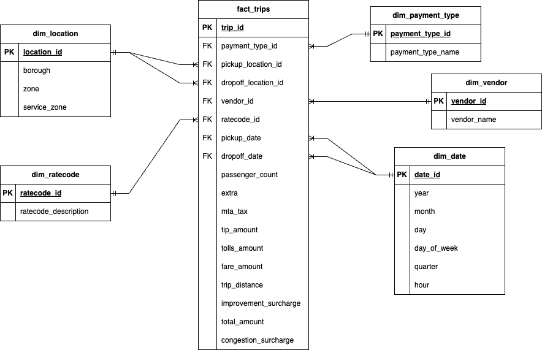
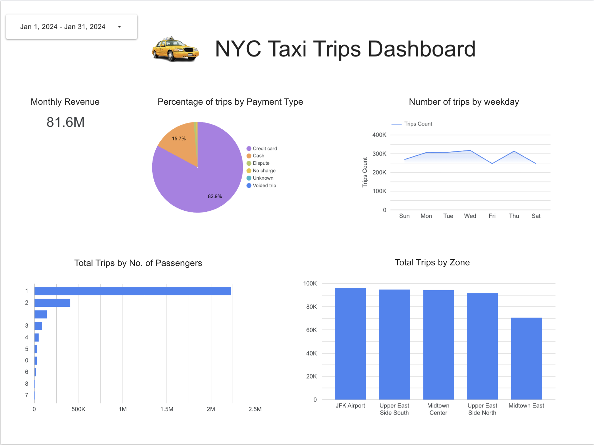

# End-to-End NYC Taxi Trips Data Pipeline

## Table of Contents

- [Problem Description](#problem-description)
- [Data Source](#data-source)
- [Technologies](#technologies)
- [Data Pipeline Architecture and Workflow](#data-pipeline-architecture-and-workflow)
  - [1. Manual Upload & Partitioning in GCS](#1-manual-upload--partitioning-in-gcs)
  - [2. Load into BigQuery](#2-load-into-bigquery)
  - [3. Transform with dbt](#3-transform-with-dbt)
  - [4. Visualization with Looker Studio](#4-visualization-with-looker-studio)
- [Further Improvements](#further-improvements)

---

## Problem Description

I operate a **monthly** batch pipeline to ingest, transform, and analyze NYC taxi trip data, extracting key business metrics:

- **Revenue trends** (total fare revenue per month).  
- **Top 5 pickup zones** by trip count.  
- **% usage by payment type** (cash vs. card) to measure the success of cash-incentive campaigns.  
- **Passenger count trends** to recommend optimal vehicle sizing (e.g., promoting 2-seater cars to reduce costs).  

Each month’s raw data arrives as Parquet files (~1–2 GB), well-organized into `year=YYYY/month=MM/` folders in Google Cloud Storage (GCS).

---

## Data Source

- **Dataset**: NYC Taxi and Limousine Commission (TLC) Trip Record Data  
  [https://www.nyc.gov/site/tlc/about/tlc-trip-record-data.page](https://www.nyc.gov/site/tlc/about/tlc-trip-record-data.page)  
- **Data Dictionary**: Yellow Taxi Trip Records  
  [https://www.nyc.gov/assets/tlc/downloads/pdf/data_dictionary_trip_records_yellow.pdf](https://www.nyc.gov/assets/tlc/downloads/pdf/data_dictionary_trip_records_yellow.pdf)  

---

## Technologies

- **Google Cloud Storage** – Object Storage for storing Parquet files, partitioned by month.  
- **Google BigQuery** – Data warehouse with monthly-partitioned tables for efficient queries.  
- **dbt Core** – Transformation and modeling to shape raw data into actionable insights.  
- **Apache Airflow** – Orchestration for seamless monthly pipeline execution.  
- **Terraform** – Infrastructure as code for GCS buckets and BigQuery datasets.  
- **Looker Studio** – Interactive dashboards for visualizing key metrics.  
- **Docker** – Reproducible local and development environments.

---

## Data Pipeline Architecture and Workflow

The workflow is as follows:

### 1. Manual Upload & Partitioning in GCS

Each month, raw Parquet files are uploaded into a structured GCS bucket, neatly organized by `year=YYYY/month=MM/`. This orderly structure ensures smooth data ingestion and scalability.  

### 2. Load into BigQuery

An Airflow task, powered by `BigQueryInsertJobOperator`, triggers a load job to pull data from GCS into BigQuery’s partitioned tables. Using `WRITE_TRUNCATE`, I ensure idempotency by replacing prior month’s data, while partitioning by pickup date optimizes query performance and reduces costs.  

### 3. Transform with dbt

dbt is the backbone of our transformation process, selected for its ability to streamline complex SQL transformations and ensure data consistency across models. It organizes raw green and yellow taxi data into a star schema, with `fact_trips` as the central fact table and dimensions like `dim_date`, enriched by static seed files such as `dim_locations`, `dim_payment_types`, `dim_vendors`, and `dim_ratecodes`. This structure delivers clean, deduplicated data with keys like `trip_id` and `pickup_date`, optimized for analysis. Incremental updates process only new monthly data, enhancing efficiency.  

### 4. Visualization with Looker Studio

---

## Further Improvements

- **Host Airflow on GCE**: Enable high availability and autoscaling for robust orchestration.  
- **CI/CD Pipeline**: Implement GitHub Actions for DAG linting, dbt testing, and automated deployments.  
- **Data Quality Checks**: Integrate Great Expectations for advanced validation before and after transformations.

